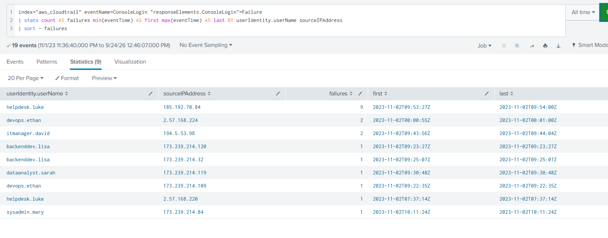
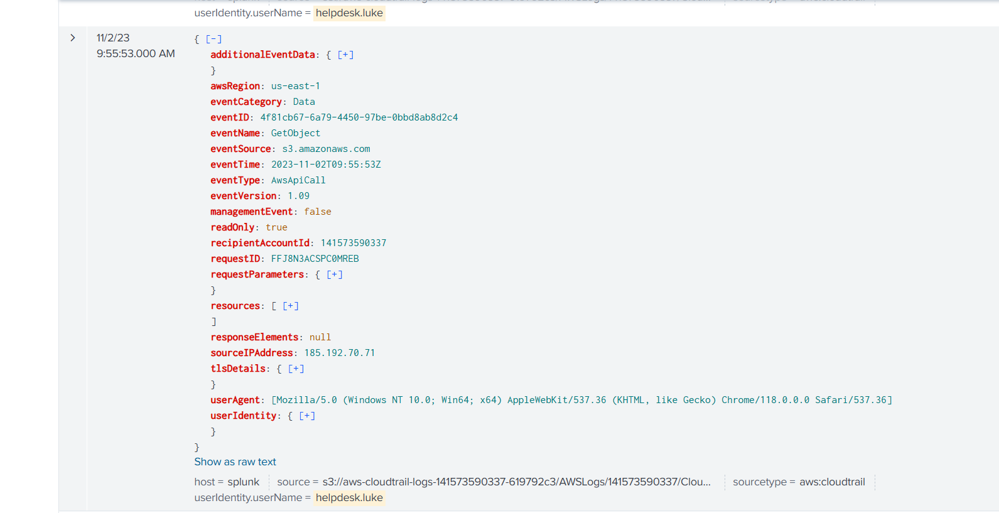
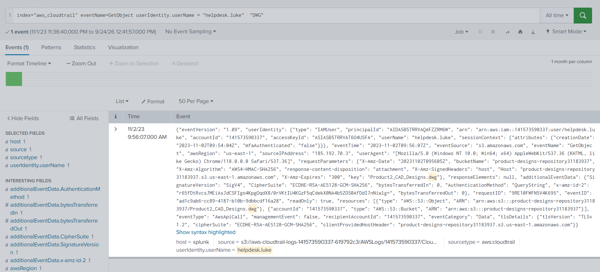
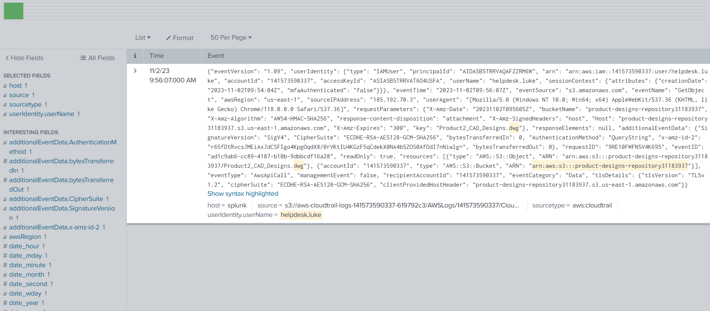
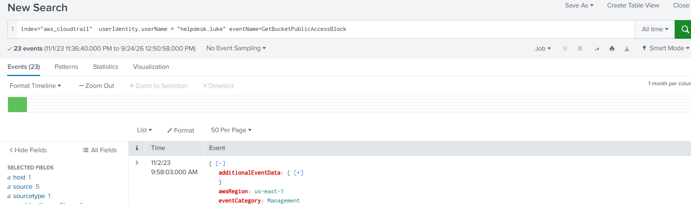
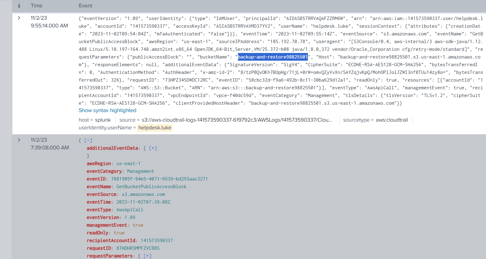
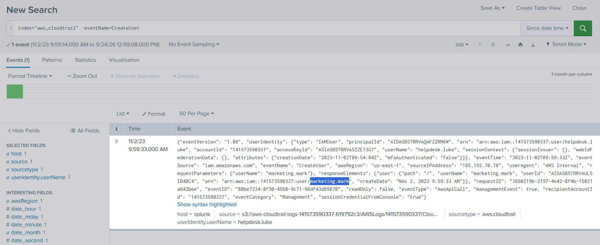
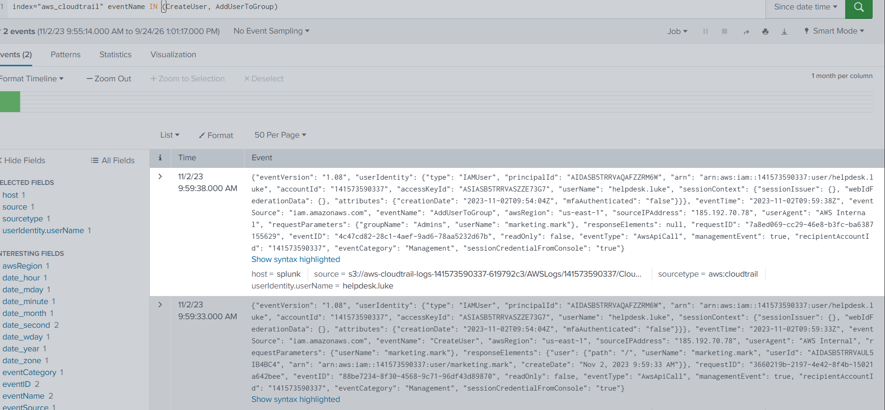

# AWS CloudTrail Investigation with Splunk

In this lab I investigated a compromised AWS account using CloudTrail logs loaded into Splunk. I started with nothing except the logs and tried to rebuild what the attacker did: how they got in, what they touched, and how they tried to stay in the environment.

I'm doing these labs to get better at cloud log analysis for SOC work. I already built an attack myself in my IAM compromise lab, so this time I wanted to be on the other side and investigate an incident I didn't design.

The lab is **[AWSRaid](https://cyberdefenders.org/blueteam-ctf-challenges/awsraid/)** from CyberDefenders (Cloud Forensics, Easy). All credit for the scenario and the data goes to them. I'm sharing my own approach and notes here, not the lab files.

**Platform:** CyberDefenders
**Tools:** Splunk (SPL), AWS CloudTrail
**Index:** `aws_cloudtrail`

---

## Attack timeline

All times are UTC, on 2023-11-02.

| Time | Source IP | Event | What happened |
|------|-----------|-------|---------------|
| 09:53:27 to 09:54:00 | 185.192.70.84 | `ConsoleLogin` failed 9 times | Brute force on `helpdesk.luke` |
| 09:54:04 | 185.192.70.84 | Session created | Login worked, no MFA |
| 09:55:14 | 185.192.70.78 | `GetBucketPublicAccessBlock` | Looked at `backup-and-restore98825501` |
| 09:55:53 | 185.192.70.71 | `GetObject` | First S3 object access |
| 09:56:07 | 185.192.70.3 | `GetObject` | Downloaded `Product2_CAD_Designs.dwg` |
| 09:59:33 | 185.192.70.78 | `CreateUser` | Created `marketing.mark` |
| 09:59:38 | 185.192.70.78 | `AddUserToGroup` | Put `marketing.mark` in `Admins` |

---

## Q1: Which user was compromised?

I started with failed console logins, because a brute force usually shows up there first. I grouped them by user and IP and sorted by the number of failures.

```spl
index="aws_cloudtrail" eventName=ConsoleLogin "responseElements.ConsoleLogin"=Failure
| stats count AS failures min(eventTime) AS first max(eventTime) AS last BY userIdentity.userName sourceIPAddress
| sort - failures
```



`helpdesk.luke` stood out right away: 9 failures from `185.192.70.84` in about 30 seconds. The other users only had 1 or 2 failures each, which looks like normal typos. Later, every attacker event had a session `creationDate` of `09:54:04Z`, which is 4 seconds after the last failure. So the password was guessed and the login went through. The session also had `mfaAuthenticated: false`.

**Answer:** `helpdesk.luke`

---

## Q2: When did the attacker first access an S3 object?

Once I had the user, I looked for `GetObject` events from that account and sorted them by time.

```spl
index="aws_cloudtrail" eventName=GetObject userIdentity.userName="helpdesk.luke"
| sort 0 _time
```



The first one was at `09:55:53Z`, from `185.192.70.71`.

At first I searched with the IP `185.192.70.84` from the brute force and got nothing. The attacker was switching IPs inside the same `/24` range, so filtering on one IP was a mistake. Filtering on the username worked much better.

**Answer:** `2023-11-02 09:55`

---

## Q3: Which bucket contains the DWG file?

DWG is an AutoCAD format, so I just searched for the string in the attacker's `GetObject` events.

```spl
index="aws_cloudtrail" eventName=GetObject userIdentity.userName="helpdesk.luke" "DWG"
```





The file was `Product2_CAD_Designs.dwg`. The request had `response-content-disposition: attachment`, so it was an actual download from the console and not only a preview. This was the point where the motive became clear to me: the attacker was after product designs.

**Answer:** `product-designs-repository31183937`

---

## Q4: Which bucket had its public access configuration changed?

For this one I looked at the Public Access Block events made by the compromised user.

```spl
index="aws_cloudtrail" userIdentity.userName="helpdesk.luke" eventName=GetBucketPublicAccessBlock
```



This returned a lot of events, because opening buckets in the S3 console triggers this call for each of them. So I only kept the ones inside the attacker's session (after 09:54:04), and `backup-and-restore98825501` was the bucket that matched.



One thing I want to be honest about: `GetBucketPublicAccessBlock` only reads the setting, it doesn't change it. The event that actually opens the bucket would be `PutBucketPublicAccessBlock`, `DeleteBucketPublicAccessBlock` or `PutBucketPolicy`. The answer was accepted, but in a real investigation I would still go and confirm the write event.

**Answer:** `backup-and-restore98825501`

---

## Q5: What account did the attacker create?

A new user is a classic way to keep access, so I searched for `CreateUser`.

```spl
index="aws_cloudtrail" eventName=CreateUser
```



There was only one, made by `helpdesk.luke` from `185.192.70.78`. The new name is in `requestParameters.userName`, not in `userIdentity` (that one is the creator). I noticed the attacker picked a name that follows the company's naming style (`department.name`), so it doesn't look strange in the user list.

**Answer:** `marketing.mark`

---

## Q6: Which group was the new account added to?

A new user has no permissions, so I expected the attacker to give it some right after. I searched both events together.

```spl
index="aws_cloudtrail" eventName IN (CreateUser, AddUserToGroup)
```



5 seconds after creating the user, the attacker added it to `Admins`. That gives them a full admin backdoor that still works even if Luke's password gets reset.

**Answer:** `Admins`

---

## What I learned

- **Don't pivot on one IP.** The attacker used `.84`, `.78`, `.71` and `.3`, all from `185.192.70.0/24`. The username and the session `creationDate` were much more reliable.
- **Access keys change too.** Console sessions create temporary `ASIA...` keys, so the key ID was different across events.
- **Get vs Put.** A `Get*` event is someone looking at a setting, a `Put*` or `Delete*` is someone changing it. It's easy to mix them up when you're moving fast.
- **Splunk syntax.** Lowercase `and` is treated as a search word, not an operator, and two conditions on the same field need `OR` or `IN`, not a space.

## MITRE ATT&CK

| Technique | ID |
|-----------|----|
| Brute Force | T1110 |
| Valid Accounts: Cloud Accounts | T1078.004 |
| Data from Cloud Storage | T1530 |
| Create Account: Cloud Account | T1136.003 |
| Account Manipulation | T1098 |

## What would have stopped this

- MFA on every IAM user. The password fell after 9 tries and nothing else was in the way.
- Least privilege. A helpdesk account should not be able to read design files or create IAM users.
- S3 Block Public Access turned on at the account level, not just per bucket.
- Alerts on several failed logins followed by a success, and on any user added to `Admins`.
